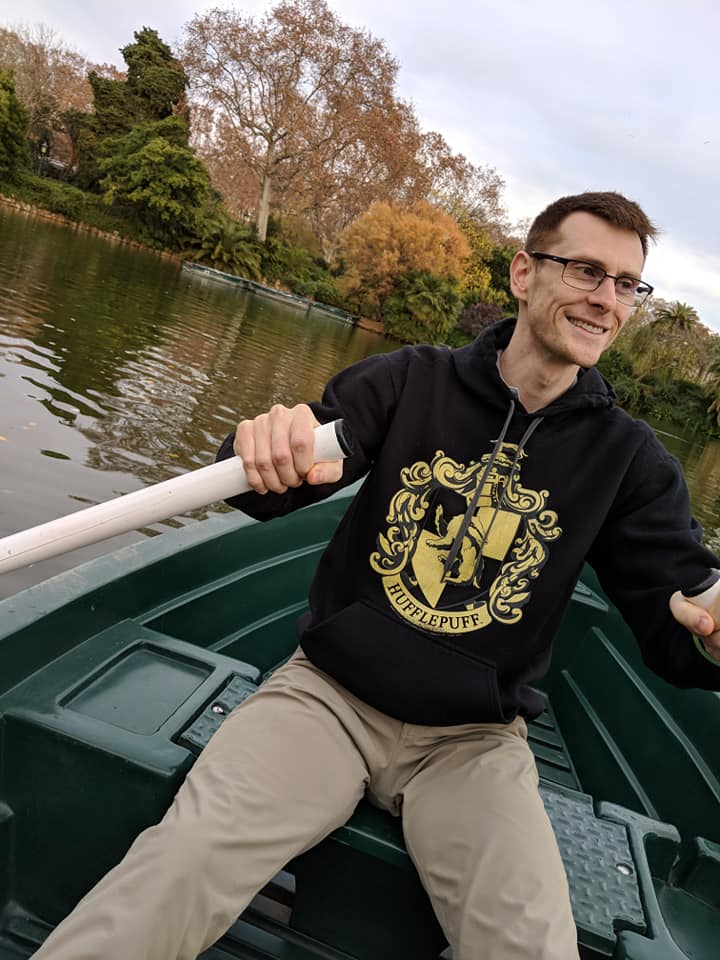

## Data Scientist with Interest in Gaming Industry and Sports. Also a huge cat lover.
  
   Looking for a position in Data Science or Data Analytics that will allow on the job learning 
  as well as an opportunity for me to add value to an organization. I'm a friendly, charismatic professional 
  with a strong blend of experience in clinical research and data analysis with an interest in the Sports and Gaming Industries. 
  My strong one-on-one consultation/communication skills and strong motivation to succeed have allowed me to consistently be a 
  valuable member of any organization. 
  <a href="https://www.linkedin.com/in/coryrutkowski/">View My LinkedIn Profile</a> 
   
  [About Me](/about_me.md)
   

# Portfolio

---

## Projects

[Analysis and Visualization of NFL Draft Prospects](/project1_page.md)
 

 
 
Using SQL and supervised learning models I predicted and visualized the NFL draft process for collegiate football players. I created a multi-class classification neural network model to determine what position (round) each player might get drafted into.
Used a combination of my own created PostgreSQL database and Tableau to visualize the different data relationships.
I feel that this model could be beneficial in the future for collegiate athletes to try to determine if their current body of work is enough for them to continue their dream of playing in the NFL, or if they should continue to try to improve their skills/stats/awards to try to better improve their draft chances.

There are several areas that I want to improve on and will continue working on in the future:
- Getting more Up-to-Date Data
- Creating Additional Metrics to Use in Model
- Continue Analysis by Position Breakdown
- Increase Model Performance
- More Advance Visualizations
 

---
[Using Machine Learning and NLP to Try to Catch 'Em All](/project2_page.md)
 

 
 
Using Reddit's API, I collected posts from two subreddits of my choosing (Pokemon related subreddits). I then used Natural Language Processing to train a classifier on which subreddit a given post came from.
I created a binary classification model to accurately predict which subreddit a Pokémon related post/comment came from. I analyzed the data using NLP to try to find any significant patterns in order to try to increase my model's predictive power.
The final model that I ended up using was: SVM using TF-IDF and Lemmatized Data Train Score: 99.8% Accuracy Test Score: 91.8% Accuracy
Some of the main takeaways of my models were:
Test score: 91.8% showed great improvement over Baseline Accuracy Score: 50%
Of all of the best fit models created, half used English stop-words while other half didn’t use any stop words. I'm not super surprised by this since I was dealing with data that revolved around the world of Pokémon, where many of the names/places mentioned aren't found in the English language.
 

---
[Leveraging Social Media to Map Natural Disasters](/project3_page.md)
 

 
 
Collected a large amount of tweets relating to a previous natural disaster (Hurricane Harvey) and created a multi-step model to classify which tweet needed assistance and then extracted geographic data to map their locations.
Used Natural Language Processing and Google Maps API, all physical addresses were extracted from each assistance-related tweet and then marked onto an interactive map designed to be used by rescue workers.
Additional interactive features on the map, such as body of tweet and date/time, are currently being improved upon.
 

---

## Blog Posts

- [My Long and Winding Data Science Journey](https://medium.com/@cory.rutkowski/my-long-and-winding-data-science-journey-701921ad6c0d)
---

---

Page template forked from <a href="https://github.com/evanca/quick-portfolio">evanca</a>

<!-- Remove above link if you don't want to attibute -->
